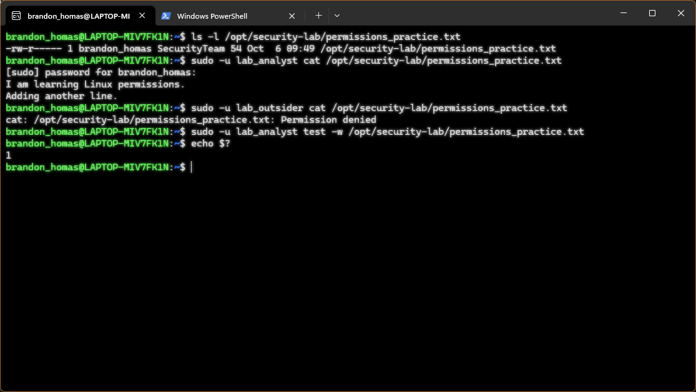
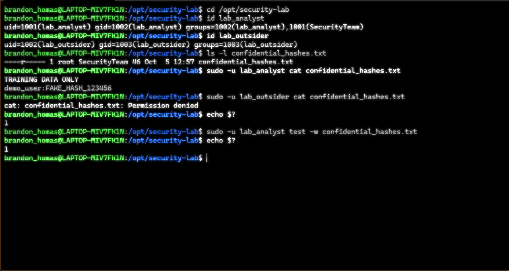

# Linux User Management and Permissions Hardening

## Overview

I completed this hands-on lab in Ubuntu on WSL 2 to practice Linux user management and file permissions.

My goal was to give members of a security group read-only access to a training file while blocking an unauthorized user. All file contents are fake training data.

## Environment

- Windows laptop running Ubuntu through WSL 2
- Bash terminal
- Linux user, group, and file permission tools

## User and Group Setup

I created a group named `SecurityTeam` and two test users:

| User | SecurityTeam member | Intended access |
|---|---|---|
| lab_analyst | Yes | Read only |
| lab_outsider | No | No access |

Commands used:

```bash
sudo groupadd SecurityTeam
sudo useradd -m -U -s /bin/bash -G SecurityTeam lab_analyst
sudo useradd -m -U -s /bin/bash lab_outsider
```

I verified group membership with:

```bash
id lab_analyst
id lab_outsider
```

## File Setup

I created a lab directory:

```bash
sudo mkdir /opt/security-lab
sudo chmod 755 /opt/security-lab
```

The directory allows users to reach the file, but only its owner, root, can add or remove files.

I created `confidential_hashes.txt` with this fake content:

```text
TRAINING DATA ONLY
demo_user:FAKE_HASH_123456
```

## Permission Configuration

From inside `/opt/security-lab`, I ran:

```bash
sudo chown root:SecurityTeam confidential_hashes.txt
sudo chmod 040 confidential_hashes.txt
ls -l confidential_hashes.txt
```

- `chown` assigns root as the owner and SecurityTeam as the file's group.
- `chmod 040` gives the group read permission and gives no ordinary permissions to the owner or others.
- The resulting permissions display as `----r-----`.
- Root retains administrative access and can bypass these ordinary permission restrictions.

## Access Tests and Results

### Authorized read

```bash
sudo -u lab_analyst cat confidential_hashes.txt
```

Result: The file's training content was displayed.

### Unauthorized read

```bash
sudo -u lab_outsider cat confidential_hashes.txt
echo $?
```

Result: `Permission denied`, followed by exit code `1`.

### Write permission check

```bash
sudo -u lab_analyst test -w confidential_hashes.txt
echo $?
```

Result: Exit code `1`, confirming the analyst did not have write access.

The `test -w` command checks write permission without modifying the file.

## Troubleshooting

During the lab, I corrected:
- A lowercase `-u` used instead of uppercase `-U` during user creation.
- Misspelled group names and filenames.
- A missing `s` in the printf format `%s\n`.
- A space accidentally inserted into the username `lab_analyst`.

These errors reinforced the importance of exact spelling, capitalization, and reading terminal error messages.

## What I Learned

- How to create users and assign group membership.
- The difference between ownership (`chown`) and permissions (`chmod`).
- How to interpret owner, group, and other permission settings.
- How to test access as a specific user using `sudo -u`.
- Why both allowed and denied access should be tested.

This lab demonstrates least privilege: the analyst can read the file but cannot modify it, while the outsider cannot read it.

I ran the commands and verified the results myself in my WSL environment.
## Screenshot Evidence

## More Practice: File Permissions

I practiced changing permissions using numbers and letters, then tested access with two lab accounts.

For permissions_practice.txt, I used permission mode 640:

- Owner: read and write.
- SecurityTeam group: read only.
- Other users: no access.

### Verified Results

| Test | Result |
| --- | --- |
| lab_analyst reads the file | Allowed |
| lab_outsider reads the file | Permission denied |
| lab_analyst checks write access | Not allowed; exit status 1 |

I also learned that users need permission to pass through the containing directories to reach a file.

### Screenshot Evidence


The screenshot below shows group membership, file permissions, successful authorized reading, blocked unauthorized reading, and a denied write-permission check.


